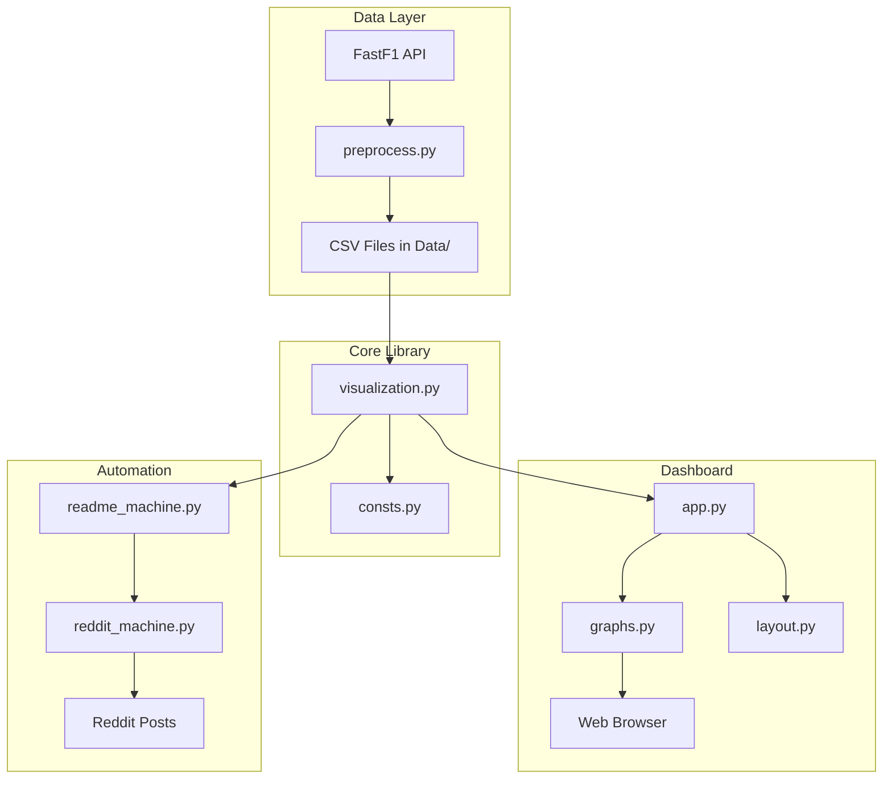
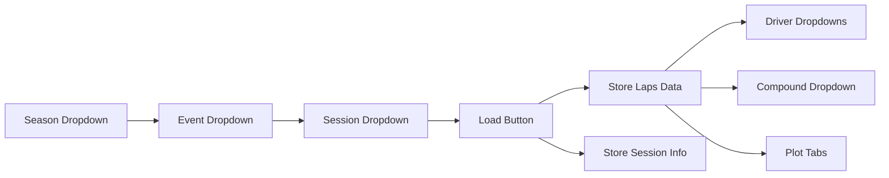

# F1 Visualizer - Codebase Documentation

A comprehensive Formula 1 strategy analysis and visualization dashboard with data from 2018 onwards.

---

## Table of Contents

1. [Project Overview](#project-overview)
2. [Architecture](#architecture)
3. [Directory Structure](#directory-structure)
4. [Core Modules](#core-modules)
5. [Dashboard Application](#dashboard-application)
6. [Data Pipeline](#data-pipeline)
7. [Automation & CI/CD](#automation--cicd)
8. [Configuration Files](#configuration-files)
9. [Getting Started](#getting-started)

---

## Project Overview

**F1 Visualizer** is a Python-based F1 data visualization platform that provides:

- **Interactive Dashboard**: Web-based Dash application for exploring race strategies, lap times, and driver comparisons
- **Automated Data Pipeline**: Scripts to fetch, transform, and store F1 telemetry data from FastF1 API
- **README Visualizations**: Auto-generated graphs for the latest race that update the README
- **Reddit Automation**: Automatic posting of race recaps to r/formula1 and r/f1technical

### Tech Stack

| Component         | Technology                  |
| ----------------- | --------------------------- |
| Backend Framework | Dash (Plotly)               |
| UI Components     | Dash Bootstrap Components   |
| Data Source       | FastF1 API                  |
| Data Processing   | Pandas, NumPy               |
| Visualization     | Plotly, Matplotlib, Seaborn |
| Styling           | Sandstone Bootstrap Theme   |
| Package Manager   | UV / pip                    |
| Code Quality      | Ruff, pre-commit            |

---

## Architecture



---

## Directory Structure

```
F1-Visualizer/
├── app.py                    # Main Dash application entry point
├── readme_machine.py         # Generate README visualizations
├── reddit_machine.py         # Auto-post to Reddit
│
├── f1_visualization/         # Core Python package
│   ├── __init__.py
│   ├── consts.py            # Constants and config loading
│   ├── preprocess.py        # Data loading and transformation
│   ├── visualization.py     # Matplotlib plotting functions
│   └── annotations.py       # Type annotations
│
├── dashboard/                # Dash-specific modules
│   ├── graphs.py            # Plotly graph generators
│   ├── layout.py            # UI layout components
│   └── visualization_config.toml
│
├── Data/                     # Data storage
│   ├── grand_prix/          # Race session CSVs
│   ├── sprint/              # Sprint race CSVs
│   ├── compound_selection.toml    # Tyre compound mappings
│   └── visualization_config.toml  # Plot styling
│
├── Automation/               # Server/deployment scripts
│   ├── data-refresh.sh      # Update data pipeline
│   ├── start-server.sh      # Launch production server
│   ├── sync-code.sh         # Git sync automation
│   └── *.exp                # Expect scripts for SSH
│
├── Assets/logos/            # Team/brand logos
├── Comments/                # Reddit comment templates
├── Docs/                    # Visual assets for README
│
├── .github/
│   ├── workflows/           # GitHub Actions
│   └── ISSUE_TEMPLATE/      # Issue templates
│
├── pyproject.toml           # Project config & dependencies
├── requirements.txt         # Pip requirements
├── SCHEMA.md               # Data column documentation
└── README.md               # Project README with visualizations
```

---

## Core Modules

### f1_visualization/consts.py

Central configuration and constants:

```python
# Key exports:
ROOT_PATH          # Project root directory
DATA_PATH          # Path to Data/ folder
CURRENT_SEASON     # Current F1 calendar year
NUM_ROUNDS         # Dict mapping season → number of rounds
SPRINT_ROUNDS      # Dict mapping season → set of sprint round numbers
SESSION_IDS        # {"R": "grand_prix", "S": "sprint"}
COMPOUND_SELECTION # Tyre compound mappings from TOML
VISUAL_CONFIG      # Visualization styling from TOML
```

### f1_visualization/preprocess.py

Data pipeline for loading and transforming F1 data:

| Function                   | Purpose                                    |
| -------------------------- | ------------------------------------------ |
| `load_all_data()`          | Load complete season data from FastF1      |
| `update_data()`            | Incrementally update existing data         |
| `correct_dtype()`          | Fix data types (Timedelta, bool, etc.)     |
| `add_is_slick()`           | Flag slick vs wet compound laps            |
| `add_compound_name()`      | Map relative → absolute compound names     |
| `add_rep_deltas()`         | Calculate delta to representative lap time |
| `add_fastest_deltas()`     | Calculate delta to fastest lap             |
| `add_fuel_adjusted_time()` | Fuel-corrected lap times                   |

### f1_visualization/visualization.py

Matplotlib-based plotting library (1300+ lines):

| Function                     | Purpose                                     |
| ---------------------------- | ------------------------------------------- |
| `load_laps()`                | Load transformed data by season             |
| `get_drivers()`              | Get driver abbreviations in finishing order |
| `get_session_info()`         | Retrieve session metadata                   |
| `add_gap()`                  | Calculate gap to specified driver           |
| `find_sc_laps()`             | Identify Safety Car/VSC periods             |
| `strategy_barplot()`         | Pit stop strategy visualization             |
| `driver_stats_scatterplot()` | Lap time scatter plots                      |
| `driver_stats_lineplot()`    | Position/gap line plots                     |
| `driver_stats_distplot()`    | Lap time distribution (violin/box)          |
| `compounds_lineplot()`       | Tyre degradation curves                     |

---

## Dashboard Application

### app.py - Main Entry Point

The Dash application with 691 lines of callbacks:

```python
# Key components:
app = Dash(
    external_stylesheets=[dbc.themes.SANDSTONE],
    title="F1 Visualizer - A F1 Strategy Dashboard"
)

# Callbacks handle:
# - Season/Event/Session selection cascading
# - Driver filtering
# - Gap calculations to selected drivers
# - Plot rendering with caching
```

### Callback Flow



### dashboard/graphs.py

Plotly graph generators for the dashboard:

| Function               | Output                                   |
| ---------------------- | ---------------------------------------- |
| `strategy_barplot()`   | Horizontal stacked bar of pit strategies |
| `stats_scatterplot()`  | Per-driver lap time scatter subplots     |
| `stats_lineplot()`     | Position/gap evolution with SC shading   |
| `stats_distplot()`     | Violin or boxplot of lap times           |
| `compounds_lineplot()` | Tyre degradation per compound            |

### dashboard/layout.py

Static UI layout using Dash Bootstrap Components:

- Session selector dropdowns
- Tab interface (Strategy, Scatter, Line, Distribution, Compounds)
- Filter controls (drivers, compounds, lap range sliders)
- Upper bound sliders for outlier filtering

---

## Data Pipeline

### Data Sources

All data from [FastF1](https://github.com/theOehrly/Fast-F1) Python package.

### CSV File Types

1. **all*laps*\*.csv** - Raw lap data from FastF1
2. **transformed*laps*\*.csv** - Enriched data with computed columns

### Key Computed Columns (see SCHEMA.md)

| Column           | Description                     |
| ---------------- | ------------------------------- |
| `IsSlick`        | True for dry compound laps      |
| `IsValid`        | Accurate, green flag, slick lap |
| `DeltaToRep`     | Seconds from median lap time    |
| `PctFromFastest` | % slower than fastest lap       |
| `FuelAdjLapTime` | Fuel-corrected lap time         |
| `GapTo{Driver}`  | Time gap to specified driver    |

---

## Automation & CI/CD

### readme_machine.py

CLI tool to generate README visualizations:

```bash
# Latest race (default)
python readme_machine.py

# Specific race
python readme_machine.py 2024 5

# Sprint race
python readme_machine.py 2024 5 --sprint-race

# Update README
python readme_machine.py --update-readme
```

Generates 8 plots:

- Strategy, Position, Lap times, Fuel-adjusted
- Podium gap, Team pace, Teammate comparison, Driver pace

### reddit_machine.py

PRAW-based Reddit automation:

- Posts gallery to r/formula1 and r/f1technical
- Uses comment templates from `Comments/` folder
- Requires `praw.ini` configuration (gitignored)

### Automation Scripts

| Script            | Purpose                           |
| ----------------- | --------------------------------- |
| `data-refresh.sh` | Full data update for all seasons  |
| `start-server.sh` | Launch Gunicorn production server |
| `sync-code.sh`    | Git pull with SSH handling        |
| `auto-pull.exp`   | Expect script for SSH automation  |

---

## Configuration Files

### pyproject.toml

- Project metadata and dependencies
- Extensive Ruff linter configuration
- Build system: setuptools

### Data/compound_selection.toml

Maps each round to its tyre allocation:

```toml
[season.round]
C1 = "HARD"
C2 = "MEDIUM"
C3 = "SOFT"
```

### Data/visualization_config.toml

Color palettes and plot styling:

```toml
[relative]
high_contrast_palette = { SOFT = "#FF3030", MEDIUM = "#FFC000", HARD = "#F0F0EC" }

[absolute]
palette = { C1 = "#A1A1A1", C2 = "#2B44A0", ... }
```

---

## Getting Started

### Installation

```bash
# Clone
git clone https://github.com/maybemnv/F1-Visualizer.git
cd F1-Visualizer

# Create virtual environment
python -m venv .venv
source .venv/bin/activate  # Unix
.venv\Scripts\activate     # Windows

# Install
pip install -e .

# Install pre-commit hooks
pre-commit install
```

### Running the Dashboard

```bash
python app.py
# Navigate to http://localhost:8000
```

### Updating Data

```bash
# Run preprocessing for current season
python -c "from f1_visualization.preprocess import update_data; update_data(2024, ...)"
```

---

## License

Apache 2.0 - See LICENSE.txt
