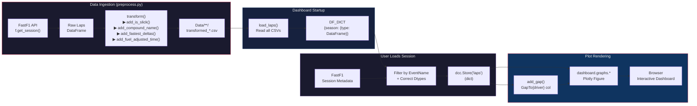
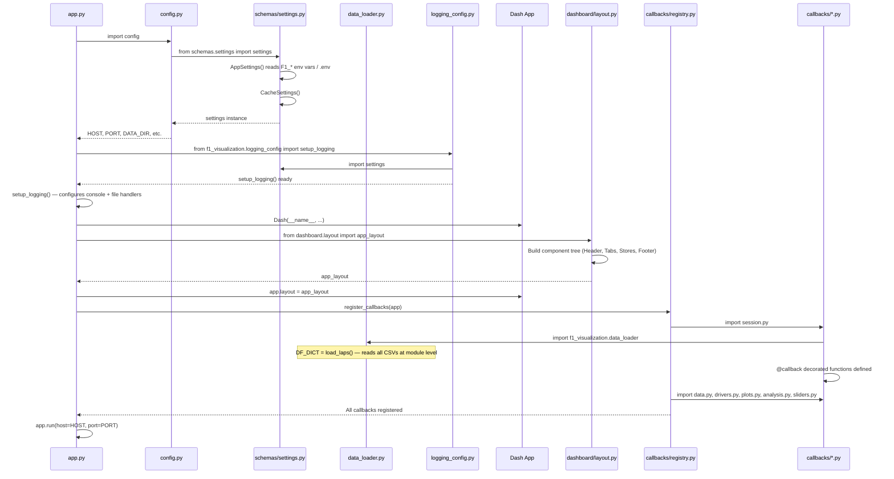
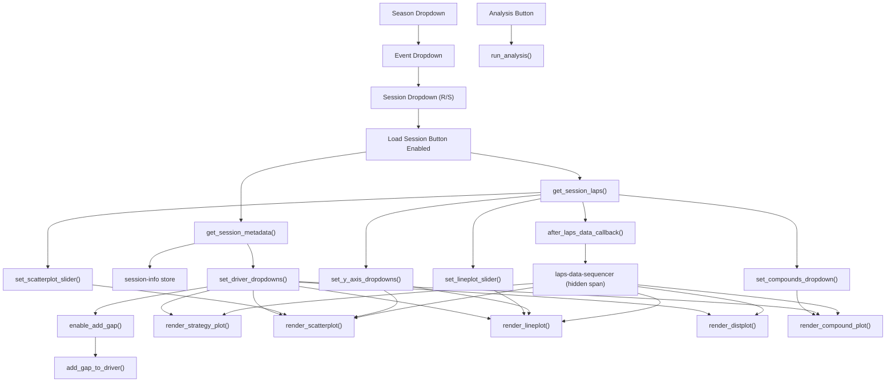
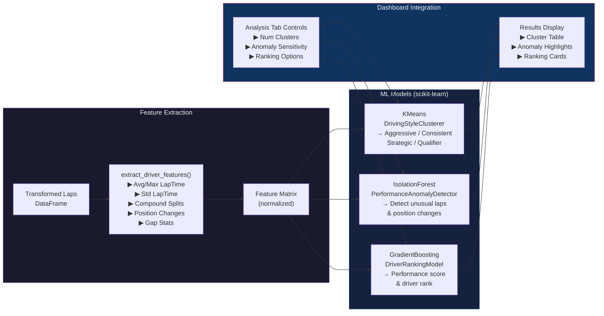

# Architecture

## Package Dependency Diagram

```mermaid
flowchart TB
    subgraph EXT["External Dependencies"]
        FAST["fastf1<br/>F1 Timing API"]
        PLOT["plotly"]
        DASH["dash<br/>dash-bootstrap-components"]
        ML_LIB["scikit-learn<br/>KMeans, IsolationForest,<br/>GradientBoosting"]
        PD["pandas / numpy"]
        PYD["pydantic<br/>pydantic-settings"]
    end

    subgraph ROOT["Root"]
        APP["app.py"]
        CFG["config.py"]
    end

    subgraph DASHBOARD["src/dashboard/ — UI Layer"]
        LAY["layout.py<br/>Component Tree"]
        GR["graphs.py<br/>Plotly Figure Builders"]
        UT["utils.py<br/>Slider Config, Timedelta,<br/>Compound Styling"]
        CB["callbacks/<br/>6 Modules"]
        CO["components/<br/>Session Picker, Tabs,<br/>Gap Controls, Legends"]
        AL["async_loader.py<br/>ThreadPool-based<br/>Async Loading"]
    end

    subgraph CORE["src/f1_visualization/ — Core Layer"]
        DL["data_loader.py<br/>DF_DICT = load_laps()"]
        PP["preprocess.py<br/>FastF1 Fetch →<br/>Transform → CSV"]
        HP["helpers/<br/>gap.py, filters.py"]
        SS["session/<br/>info.py"]
        ML["ml/<br/>clustering.py, anomaly.py,<br/>ranking.py, features.py"]
        SC["schemas/<br/>lap_data.py, session_info.py,<br/>settings.py"]
        CA["cache/<br/>manager.py, decorators.py"]
        CO2["consts.py<br/>Seasons, Compounds,<br/>TOML Config"]
        AN["annotations.py<br/>Type Aliases"]
        EX["exceptions.py<br/>Error Hierarchy"]
        LG["logging_config.py<br/>setup_logging()"]
        VS["visualization.py<br/>Backward-compat Re-exports"]
    end

    APP --> CFG
    APP --> LAY
    APP --> CB
    CFG --> SC

    CB --> DL
    CB --> GR
    CB --> ML
    CB --> SS
    CB --> AL
    GR --> HP
    GR --> SC
    GR --> AN
    UT --> CO2
    UT --> HP

    DL --> CO2
    PP --> FAST
    SS --> FAST
    VS --> DL
    VS --> HP
    VS --> SS

    DASH --> LAY
    DASH --> CO
    PLOT --> GR
    ML_LIB --> ML
    PYD --> SC

    style ROOT fill:#1a1a2e,color:#eee,stroke:#e94560
    style DASHBOARD fill:#16213e,color:#eee,stroke:#0f3460
    style CORE fill:#1a1a2e,color:#eee,stroke:#533483
    style EXT fill:#0f3460,color:#eee,stroke:#e94560
```

---

## Data Flow

---

## Initialization Sequence

---

## Callback Dependency Graph

---

## ML Subsystem

---

## Key Architectural Decisions

### Two-Layer Design
`f1_visualization/` is a pure data/science package with **zero Dash dependency**. The ML pipeline, caching, and data transforms can be used independently in notebooks or CLI scripts.

### Module-Level Singleton
`DF_DICT` (a `dict[int, dict[str, pd.DataFrame]]`) is populated at import time by scanning all transformed CSVs. All callbacks read from this shared in-memory dictionary, avoiding redundant file I/O.

### Sequencing Via Hidden Store
The `laps-data-sequencer` pattern (a hidden `html.Span` whose children update after laps load) ensures plot callbacks only fire after data is fully ready, preventing race conditions.

### Two Plotting Backends
- **`dashboard/graphs.py`** — Plotly figures for the interactive web dashboard
- **`f1_visualization/plots/`** — Matplotlib figures for programmatic/offline analysis

### Pydantic-Driven Configuration
All settings use `AppSettings` / `CacheSettings` with environment variable support (`F1_` prefix). Paths resolve via a `pyproject.toml` sentinel search that works in both source trees and Docker deployments.

### Preprocessing Pipeline
Data is fetched from FastF1, transformed (compound mapping, delta calculations, fuel correction), and written to CSVs by `preprocess.py`. The dashboard reads these pre-computed CSVs for fast startup.
